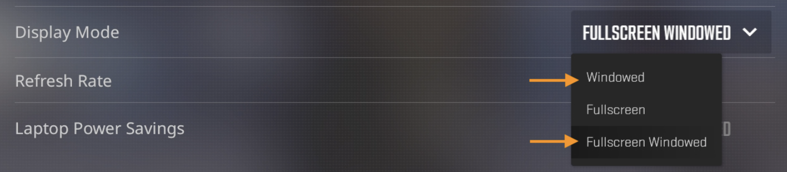
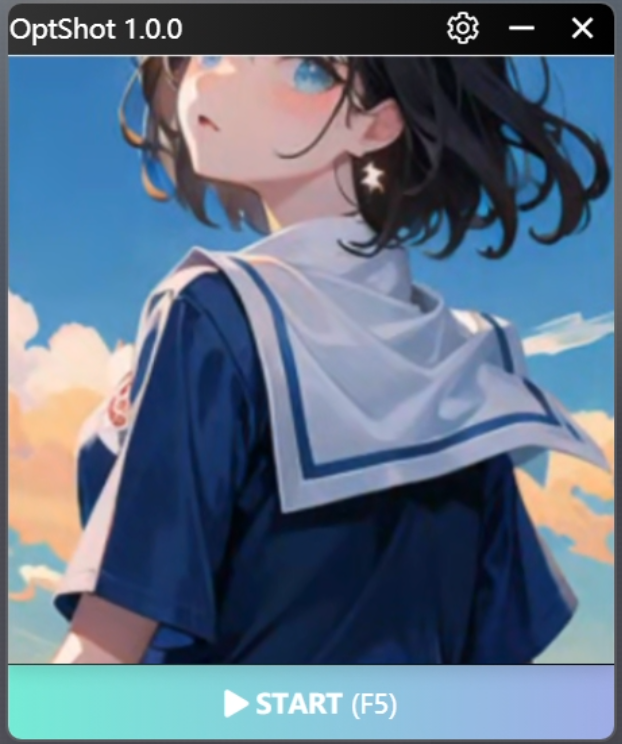
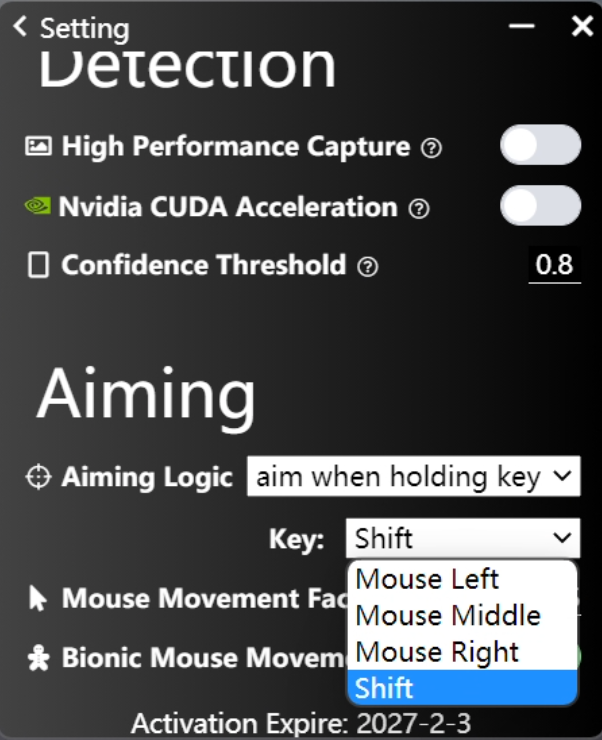

# Quickstart

1. Launch the game in either `Windowed` or `Fullscreen Windowed` mode:
   

> If you choose `Windowed` mode, please ensure the game window is centered on your screen.

2. Press the `Start` button (or use the hotkey `F5`) to start/stop:

3. The mouse will automatically aim at detected objects when you hold the `Shift` key. You can adjust the aiming logic in the settings.

