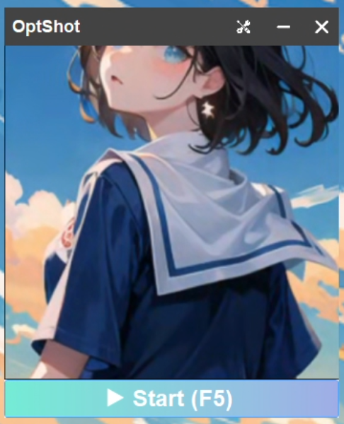

# Quickstart

1. Launch the game in **Fullscreen Windowed** mode:
   

2. Press the **Start** button (or use hotkey **F5**) to start \ stop:

3. By default, the mouse will automatically aim at the detected objects when you hold the **Shift** key. 
 You can change the aiming logic in the settings.