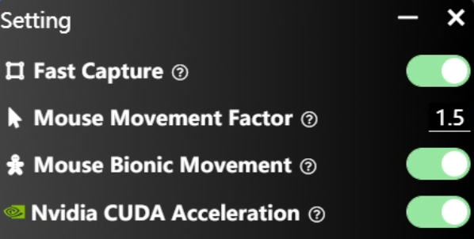

# Settings



## Fast Capture

Using the Microsoft DXGI API to capture the screen, achieving a detection speed of up to 240 FPS. If you encountered Error: DXGI_ERROR_UNSUPPORTED, see [here](./subpages/dxgi_error_unsup.html).

## Mouse Movement Factor
Due to differences in screen DPI and in-game Mouse Sensitivity settings, it's suggested to calibrate the mouse movement range to ensure accurate aiming. 


::: details
1. Open a bot map and keep the bot stationary using the following console commands ([video tutorial](https://www.youtube.com/watch?v=aQGWp-XiwNM&ab_channel=FunVector)):
```bash
sv_cheats 1
bot_stop 1
```

2. Slightly move the mouse pointer away from the bot. 

3. Make sure the OptShot is in **stop** mode. Press F6 to execute a single `Mouse Movement` procedure.

4. Adjust the factor, a higher value make the movement distance greater. Too large a value will cause the mouse to vibrate.
A proper value makes the pointer roughly aligns with the bot.  

:::


## Mouse Bionic Movement

Mimicking human-like mouse movement trajectories based on time series AI. Enabling this option may slightly affect the speed of mouse movement.

## Nvidia CUDA Acceleration

For Nvidia GPU, you can utilize CUDA to accelerate detection, usually resulting in 200% speed boost.

However, be aware that if your GPU was already exhausted by the game, the detection speed might be slower than CPU. In such cases, try:

1. Limit CS's maximum frame rate via console command `fps_max 60`.

2. Lower the game interface quality or use a lower game resolution.