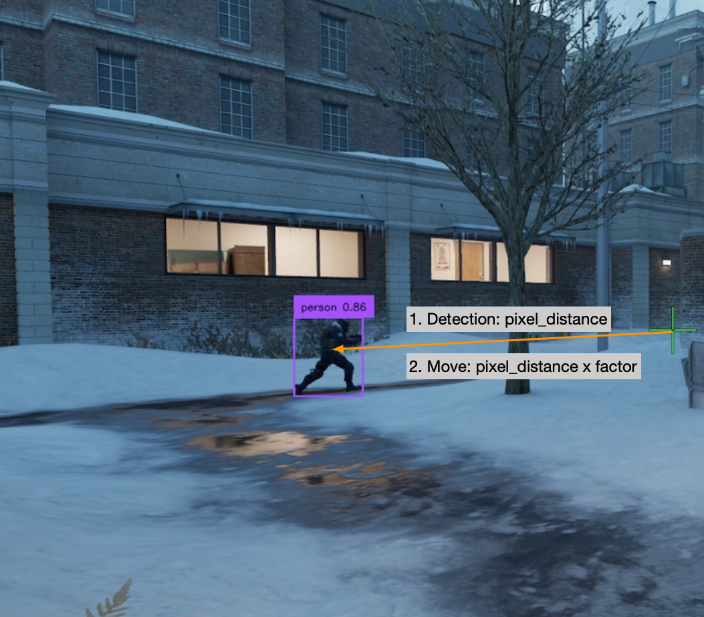

## Fast Capture

Using the Microsoft DXGI API to capture the screen, achieving a detection speed of up to 240 FPS. If you encountered
Error: DXGI_ERROR_UNSUPPORTED, see [here](./subpages/dxgi_error_unsup.html).

## Mouse Movement Factor

When executing mouse movement, the software can detect the **pixel distance** between the mouse pointer and the target.
However, due to factors such as the game's field of view, resolution, mouse sensitivity, etc., moving a corresponding
number of pixels in the simulation does not result in a corresponding pixel distance moved in the game. Usually the
movement is slightly less, for example, 
executing a 100-pixel movement may only result in a 60-pixel movement effect. 
Therefore, a magnification **factor** is multiplied by the detected pixel distance during movement in order to achieve
precise positioning.

A smaller factor will require multiple movements to approach the target, 
which is usually acceptable. This value should not be set too large, as it may cause the mouse to shake violently.

You can press **F6** for auto calculating a proper value, see the [detail](./subpages/auto_mouse_calibration.html).

## Mouse Bionic Movement

Mimicking human-like mouse movement trajectories based on time series AI. Enabling this option may slightly affect the
speed of mouse movement.

## Nvidia CUDA Acceleration

For Nvidia GPU, you can utilize CUDA to accelerate detection, usually resulting in 200% speed boost.

However, be aware that if your GPU was already exhausted by the game, the detection speed might be slower than CPU. In
such cases, try:

1. Limit CS's maximum frame rate via console command `fps_max 60`.

2. Lower the game interface quality or use a lower game resolution.