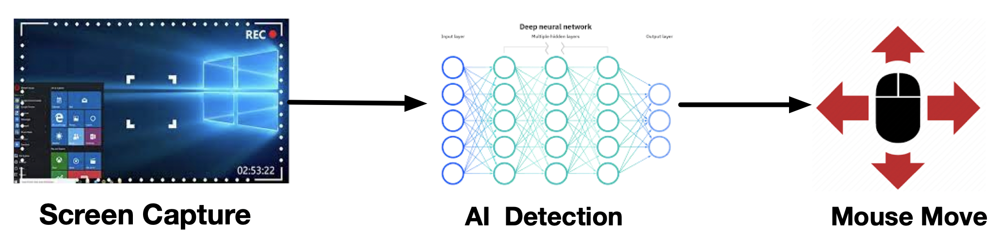

# Frequently Asked Questions

## How does it work?
OptShot captures a 640x640 area at the screen center, employs AI object detection to locate characters within it, and then controls the mouse for aiming.

## Does it support games other than CS2?
In theory, yes, but OptShot is not optimized for these games now.
