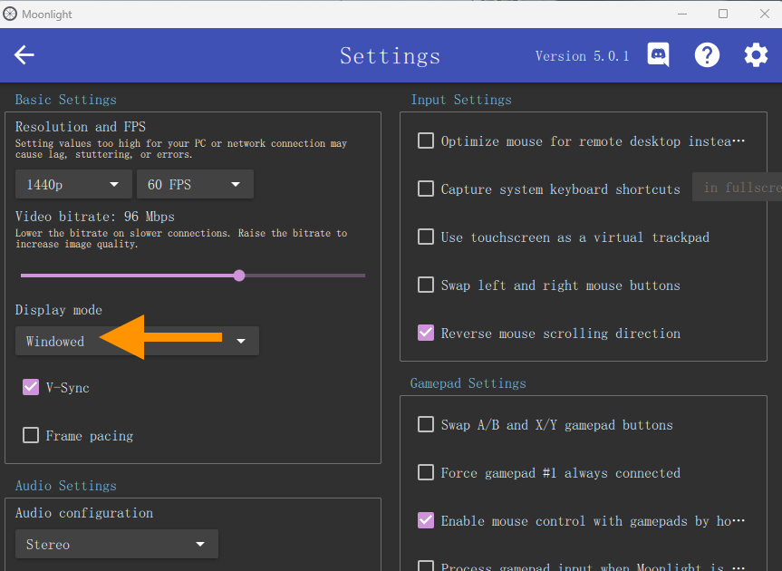

# Enhancing Security with Game Streaming

OptShot supports running on the streaming client to provide enhanced security.

You need two Windows PCs to achieve this:

**Device A**: Runs the game and the streaming host ([Sunshine](https://app.lizardbyte.dev/Sunshine) or Nvidia GeForce Experience).

**Device B**: Runs the streaming client  ([Moonlight](https://moonlight-stream.org/)) and OptShot.

Note that Moonlight needs to run in `Windowed` mode; otherwise, it may result in slow screenshot speeds or aiming anomalies:

> For guidance on implementing game streaming using Sunshine + Moonlight, please refer to the following link:
> 
> [Low-Latency Remote Desktop for Gaming and Work](https://www.youtube.com/watch?v=YBH3MAvylVg)
> 
> [How to use Moonlight with any GPU! Setting up Sunshine for Moonlight](https://www.youtube.com/watch?v=Wb8j8Ojd4YQ)

> Issues may arise when using Steam Link or remote desktop (e.g., Parsec), but Moonlight is fully supported.