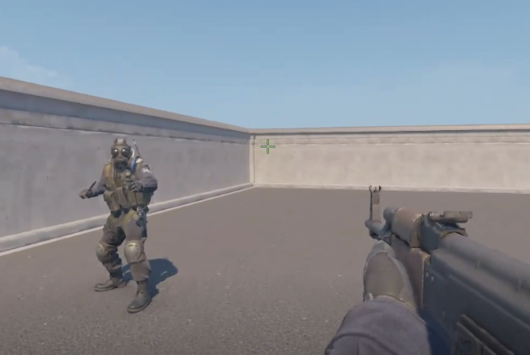
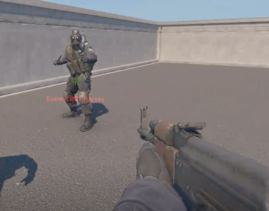
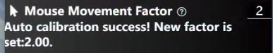

# Auto Mouse Calibration

Before executing the mouse auto-calibration, 
it is necessary to have a stationary character in the game screen.
A simplest method is to create a bot map and keep the bot stationary using the following console commands ([video tutorial](https://www.youtube.com/watch?v=aQGWp-XiwNM&ab_channel=FunVector)):
```bash
sv_cheats 1
bot_stop 1
```

Then, slightly move the mouse pointer away from the bot.

   

Press F6 (Note: the software should be in the Setting page). 

If the calibration is success, you can see the pointer is aligns with the bot.

   

And the factor is also updated.

