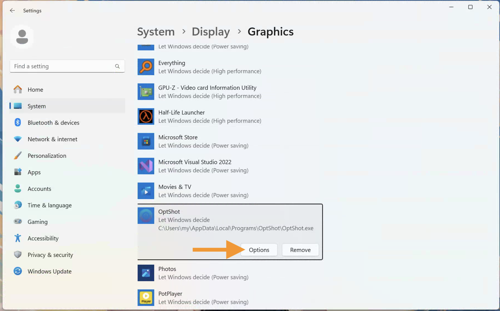

# DXGI_ERROR_UNSUPPORTED

> This Error typically occurs on laptop which has both integrated graphics and discrete graphics card.

**Solution-1:** (Recommend)

Enable direct connection mode for the discrete graphics card (disable the integrated graphics card on the laptop).

**Solution-2:**

1. Open `System -> Display -> Graphics` ,and browse the Optshot application (you can choose the application icon on your desktop)

2. Press `options`

3. Set OptShot to use discrete graphics card. Then restart the computer.

